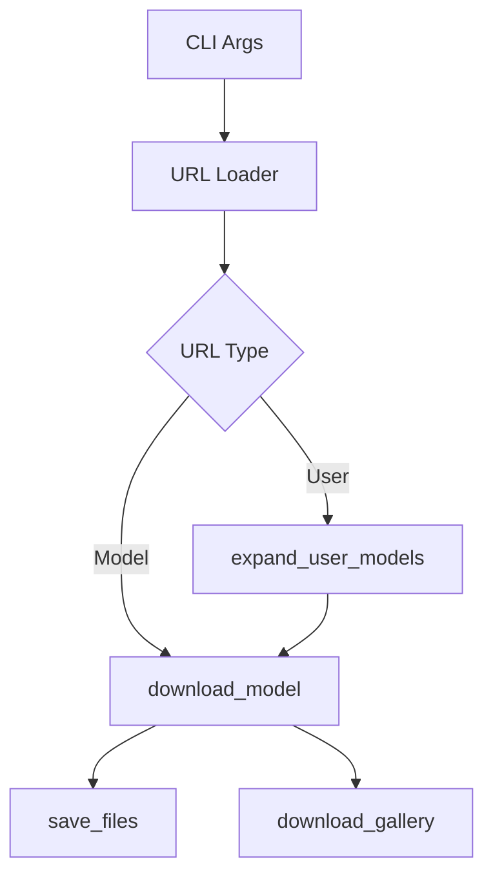

# Civitai Downloader CLI 仕様書

## 1. 要件定義書

### 1.1 目的
Civitai に公開されている Model／Image を大量に高速・安定して取得し、ローカルに保存する。ユーザー単位・モデル単体の両方を柔軟に指定でき、失敗時は自動で再試行する。

### 1.2 用語
| 用語 | 意味 |
|------|------|
| Model API | `GET /api/v1/models/:modelId`, `GET /api/v1/model-versions/:modelVersionId` など |
| Image API | `GET /api/v1/images`（`modelId` / `username` パラメータでギャラリー抽出） |
| User Link List | 1 行 1 ユーザー URL (`https://civitai.com/user/<username>`) を列挙した txt |
| Model Link List | 1 行 1 モデル URL (`https://civitai.com/models/<id>`) を列挙した txt |

### 1.3 機能要件
1. CLI で動作し、下記引数を受け付ける  
   `--users users.txt` / `--models models.txt` / `--output <dir>` / `--token <API_KEY>` など  
2. User リストと Model リストを同時に与えた場合、重複を除きダウンロード対象を決定。片方のみの指定も可。  
3. モデルを取得する際は  
   - プレビュー画像（Gallery）  
   - HTML 形式の説明文  
   - すべての Model Version のファイル  
   - Gallery API で公開されている追加画像  
   を保存する。  
4. 失敗（タイムアウト・5xx・ネットワーク）の際は指数バックオフで最大 **N** 回再試行。コンフィグで変更可。  
5. Model API と Image API は独立スレッド／タスクで非同期並列実行。片方の失敗は他方へ影響しない。  
6. 数百モデル以上でも安定動作。並列数・帯域をオプションで調整可。  
7. 全体進捗を表示：`現在 42/180 モデル、失敗 3 件 (再試行中…)` のようにリアルタイム更新。  
8. NSFW フラグの有無にかかわらずダウンロードできる（`nsfw` パラメータを明示的に渡す）。  
9. User 指定時は、そのユーザーが投稿したすべての Image も取得対象。  
10. Image だけ／Model だけのケースも正しく処理。  

### 1.4 非機能要件
| 項目 | 要件 |
|------|------|
| 性能 | 1 モデルあたり 5 秒以内でメタ情報取得。ダウンロード帯域はユーザー設定。 |
| 拡張性 | 新 API 追加時はモジュール追加のみで対応できる構造。 |
| 信頼性 | 再試行後も失敗するリクエストはログに残し、再実行スクリプトを生成。 |
| 保守 | PEP8 準拠、型ヒント、pytest によるユニットテスト 80% 以上。 |
| 配布 | `pipx install civitai-dl` 相当でワンコマンド導入可。 |

### 1.5 前提条件
* Python 3.10 以降
* Civitai API キー（環境変数 `CIVITAI_API_KEY` でも可）
* インターネット接続

---

## 2. 実装手順書 (デフォルト: 高速・拡張性重視)

> 複雑な並列 I/O と非同期処理で最大性能を発揮する構成。

### 2.1 アーキテクチャ概要
```mermaid
graph TD
    A[CLI Parser] --> B[Dispatcher]
    B -->|Model Queue| C[Model Worker(s)]
    B -->|Image Queue| D[Image Worker(s)]
    C --> E[HTTP Client(aiohttp)]
    D --> E
    C & D --> F[Filesystem Writer]
    B --> G[Progress Reporter]
```
* 入口 `cli.py` で argparse／typer。  
* Dispatcher が URL をキュー化し、非同期 Worker が `aiohttp` で API→ファイル保存。  
* 進捗は `tqdm` をスレッドセーフにラップ。

#### 2.1.1 同時ダウンロード方針 (シンプル)
* **最大 2 本** の同時ストリームのみを許容し、コードの複雑化を防ぐ。
* モデル API と Gallery API でそれぞれ 1 本ずつのタスクを `asyncio.gather()` で並列実行。
* 具体的には `asyncio.Semaphore(1)` を API ごとに配置し、以下のように実装する。

```python
async with asyncio.Semaphore(1):
    await download_model(model_id)

async with asyncio.Semaphore(1):
    await download_gallery(model_id)
```
* もし **2 本でも複雑** と判断した場合は `--no-gallery` フラグでギャラリーを後段処理に分け、**単一パイプライン**でのダウンロードへフォールバックできる仕組みを持たせる。


#### 2.1.2 リスト構築 & ダウンロードキュー
1. **列挙フェーズ**  
   - 入力 ID / username ごとに Model API を呼び `downloadUrl` を抽出 → *モデル用リスト* (`model_queue`) に追加。  
   - 同 ID に対し Images API を呼び `url` を抽出 → *ギャラリー用リスト* (`gallery_queue`) に追加。  
   - ページネーションは `metadata.nextPage` を再帰的に辿る。  
   - エラー時は即時リトライして確実にリストが完成するまで再試行。  

2. **ダウンロードフェーズ**  
   ```python
   sem_model = asyncio.Semaphore(1)
   sem_gallery = asyncio.Semaphore(1)
   await asyncio.gather(
       model_worker(model_queue, sem_model),
       gallery_worker(gallery_queue, sem_gallery),
   )
   ```  
   - 2 本以上の同時ダウンロードは行わない（各キュー1本）。  
   - `--no-gallery` 指定時は `gallery_queue` をスキップし、単一パイプラインで実行。  

3. **リカバリ**  
   - リストは JSON で `/lists/YYYYMMDD_model.json` 等に保存。  
   - 中断時は列挙をスキップして保存済みリストから再開できる。  

### 2.2 主要モジュール
| モジュール | 役割 |
|-----------|------|
| `cli.py` | 引数解析、設定ロード、Dispatcher 呼び出し |
| `dispatcher.py` | URL 読込・重複排除・タスクキュー生成 |
| `api.py` | Model API / Image API ラッパー (`aiohttp` + `tenacity` retry) |
| `download.py` | 単一モデル／画像ダウンロード実装 |
| `progress.py` | `tqdm` で進捗表示 |
| `utils/fs.py` | ディレクトリ生成、ファイル名サニタイズ |

#### 2.1.3 レートリミット & 整合性ポリシー
| 項目 | 方針 |
|------|------|
| User-Agent | `Civitai-DL/{version} (+https://github.com/your-org/civitai-dl)` を全リクエストヘッダに設定。|
| リクエスト間隔 | 既定: **モデル 0.5 req/sec, 画像 2 req/sec**。`--max-rate-model`, `--max-rate-image` で変更可。|
| 429/503 ハンドリング | `tenacity` で指数バックオフ (初回 2s → 倍々で最大 64s)。待機上限を超えたらその URL をスキップし `failed.txt` へ記録。|
| Backoff 上限待ち | 合計待機時間が 5 分を超えたらアラート出力し次のタスクへ。|
| Range Resume | **デフォルト有効**。途中で落ちた場合 `Content-Length` と既存ファイルサイズを比較し `Range: bytes=<size>-` で再開。`--no-resume` で無効化。|
| キュー再開 | ダウンロード完了時に `status=done` を SQLite に更新。CLI 再起動時は `status!=done` のみ投入。ファイル実体も確認しダブルチェック。|
| SHA256 検証 | API が返す `files[*].hashes.SHA256` とローカル計算値を比較。不一致→自動再ダウンロード（3 回まで）→それでも失敗なら `corrupted/` へ隔離。|
| 二重 DL 防止 | 同一 SHA256 が既に存在する場合はスキップし、メタだけ更新。|

### 2.3 依存ライブラリ (高速版)
* aiohttp
* tenacity
* tqdm
* rich
* pydantic (任意)

---

## 3. シンプル実装方針 (保守運用優先)

> **最小限の依存とコード量** で、担当者が少なくても長期保守できるようにする。

### 3.1 視点
* 非同期よりコード可読性を優先し、**同期 HTTP** + **ThreadPool** を採用。
* モジュール数を絞り、**単一スクリプト〜3 ファイル以内** で完結。
* 依存ライブラリは **3 つ以下** に抑える。
* 環境変数や設定ファイルは使わず、すべて **CLI オプション** で完結。

### 3.2 ディレクトリ例
```
civitai_downloader/
  __main__.py   # エントリポイント (python -m civitai_downloader)
  core.py       # ダウンロードロジック
  util.py       # 共通ユーティリティ (進捗バー・ファイル操作)
```
※ 好みで 1 ファイル版 (`civitai_downloader.py`) に統合しても可。

### 3.3 依存ライブラリ (シンプル版)
| ライブラリ | 用途 |
|------------|------|
| requests   | HTTP 通信 (公式で推奨される同期 API) |
| tqdm       | プログレスバー |
| backoff    | 再試行制御 (pure-python, 依存ゼロ) |

> `backoff` を使わず手書きループでも OK。依存 2 つまで減らせる。

### 3.4 処理フロー (同期 + ThreadPool)

1. `URL Loader` が txt を読み込み、重複排除。  
2. `concurrent.futures.ThreadPoolExecutor(max_workers=N)` で `download_model` を並列実行。  
3. `requests.get()` をタイムアウト付きで実行し、`backoff` で再試行。  
4. 各モデル処理が終わるたび `tqdm` を `update(1)`。  

### 3.5 シンプル実装のコード断片
```python
import requests, pathlib, concurrent.futures, tqdm, backoff

TIMEOUT = 30
HEADERS = {"Authorization": f"Bearer {API_TOKEN}"}

@backoff.on_exception(backoff.expo, requests.exceptions.RequestException, max_tries=5)
def fetch(url: str):
    return requests.get(url, timeout=TIMEOUT, headers=HEADERS)

def download_model(model_id: int, out_dir: pathlib.Path):
    meta = fetch(f"https://civitai.com/api/v1/models/{model_id}").json()
    # ... ファイル保存処理 ...

with open("models.txt") as f:
    ids = [int(line.rsplit('/',1)[-1]) for line in f]

with concurrent.futures.ThreadPoolExecutor(max_workers=4) as ex:
    list(tqdm.tqdm(ex.map(download_model, ids, [OUT_DIR]*len(ids)), total=len(ids)))
```

### 3.6 メリット / デメリット
| 観点 | シンプル版 | 高速版 |
|------|-----------|--------|
| 学習コスト | ★★★★☆ (requests だけ) | ★★☆☆☆ (asyncio & aiohttp) |
| 性能 | ★★☆☆☆ (I/O 待ちで CPU 遊ぶ) | ★★★★☆ |
| 依存数 | 2〜3 | 5〜6 |
| 保守性 | ★★★★★ | ★★★☆☆ |

### 3.7 選択ガイド
* **〜100 モデル/画像程度** → シンプル版で十分。  
* **数千件 & 帯域極振り** → 高速版を検討。  
* 両構成を切替できるよう、共通インターフェース (`download_model`) を意識して実装する。

---

以上、保守運用を優先した **ミニマム構成** を追記しました。既存仕様と合わせて用途に応じた選択が可能です。

## 4. 大量ダウンロードに耐えるスケール戦略

> **最初から数千〜数万モデルを想定した設計**。
>
> *IaaS 依存を避け、ローカル PC でもクラウド VM でも同じコードで動くことを前提とする。*

### 4.1 可変並列度 & 自動スロットリング
1. **トークンバケット + リクエスト実行時間** を用いた *Adaptive Concurrency*。
2. `--concurrency` が未指定の場合、CPU コア数 × 4 を上限に自動決定。
3. 429 / 5xx が一定割合超過で発生 → 並列度を半分にし、安定後に段階的に戻す。

### 4.2 永続キュー & 再開機能
| 方式 | 理由 |
|------|------|
| SQLite (標準ライブラリ *sqlite3*) | 外部依存なし・小規模でも十分速い |
| テーブル `tasks(id PRIMARY KEY, type, payload, status, retries, updated_at)` | ステータス遷移をトラック |
| CLI 起動時に `status != 'DONE'` のレコードのみ再実行 | **途中停止 → 再開** がワンコマンド |

### 4.3 I/O 最適化
* **ストリーム書き込み** (`aiohttp.stream_reader`) で大ファイルも O(数 MB) メモリで処理。
* 同一ディレクトリ内ファイル数が 1 万超を避けるため、`model_<id // 1000>/<id>/...` の 2 階層分割を採用。
* SHA256 を計算し、既存ファイルと一致すればスキップ (差分 DL)。

### 4.4 ロギング & メトリクス
* `rich` でコンソール、`loguru` でファイル (回転) を推奨。
* `--json-logs` オプションで構造化ログ。Prometheus 用 exporter は後付け可。

---

## 5. フォルダ構成 / ファイル分割ガイドライン

```
civitai_downloader_cli/
├── civitai_dl/               # ライブラリ本体 (import 可能)
│   ├── __init__.py
│   ├── cli.py                # Typer/Argparse エントリ
│   ├── config.py             # 設定&CLI共通オプション (pydantic.BaseSettings)
│   ├── scheduler.py          # タスク生成 & キュー投入
│   ├── worker.py             # 非同期 Worker (モデル/画像)
│   ├── adapters/             # 外部システムとの境界
│   │   ├── api_client.py     # Civitai REST API 呼び出し
│   │   └── storage.py        # ローカル FS / S3 等に抽象化
│   ├── domain/               # ビジネスロジック
│   │   ├── model_entity.py   # dataclass for Model, Image
│   │   └── services.py       # use-case: download_model, download_gallery
│   └── utils/
│       ├── fs.py
│       └── progress.py
├── tests/
│   ├── unit/
│   ├── integration/
│   └── load/
├── scripts/                  # 手動実行補助 (サンプル, ベンチ)
└── pyproject.toml
```

### 分割ルール
1. **関心の分離 (SoC)** – CLI/Adapter/Domain/Infrastructure を物理フォルダで分離。
2. **公開 API** は `civitai_dl.__all__` に限定し、内部モジュールは先頭に `_` を付ける。
3. 1 ファイル 400 行を越えない。複数クラスが並ぶ場合は機能単位でファイルを分ける。
4. 内部依存は *上位* から *下位* へ一方向に流れる (clean architecture)。

---

## 6. テスト設計 & 実行順序

> テストピラミッドを念頭に「単体 → 結合 → 負荷」の順で拡張。

### 6.1 静的解析 (Stage 0)
* `ruff`, `mypy`, `black --check` を pre-commit で実行。

### 6.2 単体テスト (Stage 1)
1. **ユーティリティ関数** (`fs.sanitize_name`, URL パーサ) – *Pure Function* を徹底し高速に。
2. **API クライアント** – `pytest-httpx` or `responses` でモックし、各ステータス・ページングを検証。
3. **リトライロジック** – `freezegun` で時間を固定して backoff 間隔を確認。

### 6.3 結合テスト (Stage 2)
* **Worker ↔ SQLite キュー ↔ Storage** を実際に動かし、10 モデル程度で E2E ダウンロードが成功することを検証。
* GitHub Actions ではネットワーク制限を受けるため `vcrpy` キャッシングか、Civitai sandbox アカウントを利用。

### 6.4 負荷テスト / 長時間テスト (Stage 3)
| テスト | ツール | 目的 |
|--------|------|------|
| スモーク | bash ループ | 100 モデルを 1 並列で取得できるか確認 |
| 耐久 | custom asyncio script | 24 時間連続 DL, メモリリーク検知 |
| スケール | Locust / k6 | 5k 同時リクエストでの 429 発生率測定 |

### 6.5 自動化パイプライン
1. push → *Stage 0-1* (GH Actions) – 1 分以内
2. nightly → *Stage 2* (self-hosted runner) – 10 分
3. weekly → *Stage 3* (Cloud VM) – 2 時間、結果を Slack 通知

### 6.6 KPI と Exit 条件
* 単体テストカバレッジ 85% 以上。
* 結合テスト 10 回連続グリーン。
* 負荷テストで `成功率 99.5%`, `平均スループット 50MB/s` を満たす。

---

これらを踏まえ、**最初から大規模ダウンロードが可能で、かつ長期保守しやすいプロジェクト構造**としました.
