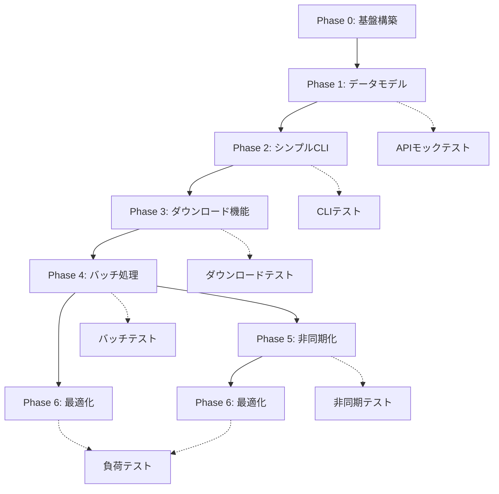

# Civitai Downloader CLI 開発計画書

## 1. 概要

### 1.1 目的
CivitaiのAIモデルとイメージを大量・高速・安定してダウンロードするCLIツールを段階的に構築する。

### 1.2 開発方針
- **段階的アプローチ**: シンプル版（同期）→ 高速版（非同期）
- **テスト駆動開発**: 各機能にAPIレスポンステストを含む包括的なテストを実装
- **継続的統合**: 各フェーズ完了時にCI/CDパイプライン構築

### 1.3 ダウンロード成果物構造
各モデルは以下の構造でダウンロードされる：

#### 本番環境（H:\Civitai\civitai-models\）
```
{root_dir}/                              # H:\Civitai\civitai-models\ or テスト用ディレクトリ
├── models/                              # モデルファイル用
│   └── {base_model}/                    # Illustrious, Pony等
│       └── {tag_category}/              # CONCEPT, CHARACTER等
│           └── {user}_{model}_{version}/    # 例: Mongooser_Tons of Tentacles_TentacleTease
│               ├── description.md       # モデル詳細説明
│               ├── {filename}.civitai.info # APIレスポンス完全保存
│               ├── {filename}.safetensors  # モデル本体
│               ├── {filename}.preview.jpeg # プレビュー画像1
│               ├── {filename}.preview.2.jpeg # プレビュー画像2
│               └── gallery/             # ギャラリー画像
│                   ├── gallery_1.jpeg
│                   └── gallery_2.jpeg
└── images/                              # 画像コレクション用（将来拡張）
```

#### 分類例
```
H:\Civitai\civitai-models\
└── models\
    ├── Illustrious\
    │   ├── CONCEPT\
    │   │   └── Mongooser_Tons of Tentacles_TentacleTease\
    │   ├── CHARACTER\
    │   │   └── ArtistName_Anime Girl_v2.0\
    │   └── STYLE\
    │       └── CreatorName_Oil Painting_v1.5\
    └── Pony\
        └── POSE\
            └── UserName_Dynamic Poses_Latest\
```

## 2. アーキテクチャ選定

### 2.1 技術スタック
```
初期フェーズ（シンプル版）:
- Python 3.10+
- requests（同期HTTP）
- tqdm（進捗表示）
- pytest（テスト）
- responses（HTTPモック）

後期フェーズ（高速版）:
- aiohttp（非同期HTTP）
- tenacity（再試行制御）
- rich（高度な進捗表示）
- pytest-asyncio（非同期テスト）
```

### 2.2 プロジェクト構造
```
civitai_downloader_cli/
├── civitai_dl/
│   ├── __init__.py
│   ├── cli.py              # CLIエントリポイント
│   ├── config.py           # 設定管理
│   ├── adapters/
│   │   ├── api_client.py   # API通信
│   │   └── storage.py      # ファイル保存
│   ├── domain/
│   │   ├── entities.py     # データモデル
│   │   └── services.py     # ビジネスロジック
│   └── utils/
│       ├── fs.py           # ファイルシステム
│       └── progress.py     # 進捗管理
├── tests/
│   ├── unit/
│   ├── integration/
│   └── fixtures/           # APIレスポンスモック
├── scripts/
├── docs/
└── pyproject.toml
```

## 3. フェーズ別開発計画

### Phase 0: プロジェクト基盤構築（2日）
**目的**: 開発環境とプロジェクト骨格の構築

#### タスク
- [ ] P0-1: プロジェクト構造作成
- [ ] P0-2: pyproject.toml設定（依存関係定義）
- [ ] P0-3: 開発環境セットアップスクリプト作成
- [ ] P0-4: pre-commitフック設定（ruff, mypy, black）
- [ ] P0-5: 基本的なCI/CD設定（GitHub Actions）
- [ ] P0-6: README.md初版作成

#### 成果物
- `pyproject.toml`
- `.pre-commit-config.yaml`
- `.github/workflows/ci.yml`
- `scripts/setup-dev.sh`

#### テスト項目
- 開発環境セットアップの動作確認
- CI/CDパイプラインの動作確認

---

### Phase 1: データモデルとAPI基盤（3日）
**目的**: Civitai APIのデータモデルとHTTP通信基盤の実装

#### タスク
- [ ] P1-1: エンティティクラス定義（Model, ModelVersion, Image）
- [ ] P1-2: APIレスポンスモックデータ作成
- [ ] P1-3: 基本的なHTTPクライアント実装
- [ ] P1-4: API認証ヘッダー管理
- [ ] P1-5: エラーハンドリング基盤（例外クラス定義）

#### 成果物
```python
# civitai_dl/domain/entities.py
@dataclass
class Model:
    id: int
    name: str
    type: str
    nsfw: bool
    versions: List[ModelVersion]

@dataclass
class ModelVersion:
    id: int
    model_id: int
    name: str
    download_url: str
    files: List[ModelFile]
    images: List[dict]

# civitai_dl/adapters/api_client.py
class CivitaiApiClient:
    def __init__(self, api_key: str):
        self.session = requests.Session()
        self.session.headers.update({
            "Authorization": f"Bearer {api_key}",
            "User-Agent": "Civitai-DL/1.0.0"
        })
```

#### テスト項目
```python
# tests/unit/test_api_client.py
def test_api_authentication(responses):
    """APIキー認証のテスト"""
    responses.add(
        responses.GET,
        "https://civitai.com/api/v1/models/123",
        json={"id": 123, "name": "test-model"},
        status=200
    )
    
    client = CivitaiApiClient("test-key")
    response = client.get_model(123)
    assert response["id"] == 123
    assert "Bearer test-key" in responses.calls[0].request.headers["Authorization"]

def test_api_error_handling(responses):
    """APIエラーレスポンスのテスト"""
    responses.add(
        responses.GET,
        "https://civitai.com/api/v1/models/999",
        json={"error": "Model not found"},
        status=404
    )
    
    client = CivitaiApiClient("test-key")
    with pytest.raises(ApiError) as exc:
        client.get_model(999)
    assert exc.value.status_code == 404
```

---

### Phase 2: シンプル版CLI実装（3日）
**目的**: 基本的なCLIインターフェースと単一モデルダウンロード機能

#### タスク
- [ ] P2-1: argparseベースのCLI実装
- [ ] P2-2: 設定管理（環境変数、CLIオプション）
- [ ] P2-3: 単一モデル情報取得機能
- [ ] P2-4: モデルメタデータ保存（JSON形式）
- [ ] P2-5: 基本的なエラーメッセージ表示

#### 成果物
```python
# civitai_dl/cli.py
def main():
    parser = argparse.ArgumentParser(description="Civitai Downloader CLI")
    parser.add_argument("--model", type=int, help="Model ID to download")
    parser.add_argument("--output", type=Path, default=Path("downloads"))
    parser.add_argument("--token", help="Civitai API token")
    
    args = parser.parse_args()
    
    # APIクライアント初期化
    api_key = args.token or os.getenv("CIVITAI_API_KEY")
    if not api_key:
        print("Error: API key required", file=sys.stderr)
        sys.exit(1)
```

#### テスト項目
```python
# tests/integration/test_cli.py
def test_cli_model_download(tmp_path, monkeypatch, responses):
    """CLIからのモデルダウンロードテスト"""
    # APIレスポンスモック
    responses.add(
        responses.GET,
        "https://civitai.com/api/v1/models/123",
        json={
            "id": 123,
            "name": "test-model",
            "versions": [{
                "id": 456,
                "files": [{
                    "name": "model.safetensors",
                    "downloadUrl": "https://example.com/model.safetensors"
                }]
            }]
        }
    )
    
    # CLI実行
    result = subprocess.run([
        "python", "-m", "civitai_dl",
        "--model", "123",
        "--output", str(tmp_path),
        "--token", "test-key"
    ], capture_output=True)
    
    assert result.returncode == 0
    assert (tmp_path / "model_123" / "metadata.json").exists()
```

---

### Phase 3: ダウンロード機能実装（4日）
**目的**: ファイルダウンロード、進捗表示、整合性検証、成果物生成の実装

#### タスク
- [ ] P3-1: ファイルダウンロード機能（requests）
- [ ] P3-2: プログレスバー実装（tqdm）
- [ ] P3-3: SHA256検証機能
- [ ] P3-4: タグベースディレクトリ構造管理（{base_model}/{tag_category}/{user}_{model}_{version}/）
- [ ] P3-5: ファイル名サニタイゼーション
- [ ] P3-6: 部分ダウンロード再開（Range対応）
- [ ] P3-7: description.md生成機能（APIレスポンスから）
- [ ] P3-8: .civitai.infoファイル保存機能
- [ ] P3-9: プレビュー画像の命名規則実装（{modelname}.preview.{番号}.{拡張子}）
- [ ] P3-10: タグベース分類ロジック実装（完全一致優先）
- [ ] P3-11: 本番/テスト環境切り替え機能

#### 成果物
```python
# civitai_dl/adapters/storage.py
class FileDownloader:
    def download_file(self, url: str, filepath: Path, 
                     expected_sha256: Optional[str] = None) -> bool:
        """ファイルダウンロードと検証"""
        response = requests.get(url, stream=True)
        total_size = int(response.headers.get('content-length', 0))
        
        with open(filepath, 'wb') as f:
            with tqdm(total=total_size, unit='B', unit_scale=True) as pbar:
                for chunk in response.iter_content(chunk_size=8192):
                    f.write(chunk)
                    pbar.update(len(chunk))
        
        if expected_sha256:
            return self.verify_sha256(filepath, expected_sha256)
        return True

# civitai_dl/services/metadata_generator.py
class MetadataGenerator:
    def generate_description_md(self, model_data: dict, version_data: dict) -> str:
        """APIレスポンスからdescription.mdを生成"""
        return f"""# {model_data.get('name', 'Unknown Model')}

**作者**: {model_data.get('creator', {}).get('username', 'Unknown')}
**タイプ**: {model_data.get('type', 'Unknown')}
**ベースモデル**: {version_data.get('baseModel', 'Unknown')}

## Detail

- **トリガーワード**:
  - {', '.join(version_data.get('trainedWords', []))}
- **モデルハッシュ**: {version_data.get('files', [{}])[0].get('hashes', {}).get('AutoV2', 'Unknown')}
- **バージョン**: {version_data.get('name', 'Unknown')}
- **ファイルサイズ**: {self._format_size(version_data.get('files', [{}])[0].get('sizeKB', 0))}
- **ダウンロード数**: {version_data.get('stats', {}).get('downloadCount', 0):,}
- **評価**: ⭐{version_data.get('stats', {}).get('rating', 0)}
- **NSFW レベル**: {model_data.get('nsfwLevel', 0)}

## 説明

{model_data.get('description', 'No description available')}

## ダウンロード情報

- **ダウンロード日時**: {datetime.now().strftime('%Y-%m-%d %H:%M:%S')}
- **ダウンロードURL**: {version_data.get('downloadUrl', 'Unknown')}
- **Civitai WebページURL**: https://civitai.com/models/{model_data.get('id')}?modelVersionId={version_data.get('id')}
- **SHA256**: {version_data.get('files', [{}])[0].get('hashes', {}).get('SHA256', 'Unknown')}
"""
    
    def save_civitai_info(self, model_data: dict, filepath: Path):
        """APIレスポンスを.civitai.info形式で保存"""
        with open(filepath, 'w', encoding='utf-8') as f:
            json.dump(model_data, f, ensure_ascii=False, indent=4)

# civitai_dl/services/path_manager.py
class PathManager:
    def __init__(self, config: DownloadConfig):
        self.config = config
        self.tag_mappings = config.tag_mappings
    
    def determine_model_path(self, model_data: dict, version_data: dict) -> Path:
        """タグベース分類でモデルの保存先パスを決定"""
        # 1. ルートディレクトリ（本番/テスト切り替え）
        root = Path(self.config.test_root if self.config.is_test else self.config.production_root)
        
        # 2. models/images分類
        type_dir = "models" if model_data["type"] in ["Checkpoint", "LORA", "LoRA"] else "images"
        
        # 3. ベースモデル分類
        base_model = version_data.get("baseModel", "Unknown")
        
        # 4. タグ分類（完全一致優先）
        tag_category = self._classify_by_tags(model_data.get("tags", []))
        
        # 5. フォルダ名: {user}_{model}_{version}
        folder_name = self._create_folder_name(model_data, version_data)
        
        return root / type_dir / base_model / tag_category / folder_name
    
    def _classify_by_tags(self, model_tags: List[str]) -> str:
        """タグに基づいてカテゴリを決定（完全一致優先）"""
        model_tags_lower = [tag.lower().strip() for tag in model_tags]
        
        # 完全一致を優先
        for category, keywords in self.tag_mappings.items():
            if category.lower() in model_tags_lower:
                return category
        
        # 部分一致でフォールバック
        for category, keywords in self.tag_mappings.items():
            for keyword in keywords:
                if any(keyword.lower() in tag for tag in model_tags_lower):
                    return category
        
        return "MISC"  # 分類不能な場合
    
    def _create_folder_name(self, model_data: dict, version_data: dict) -> str:
        """ユーザー名_モデル名_バージョン名 形式のフォルダ名を生成"""
        username = model_data.get('creator', {}).get('username', 'Unknown')
        model_name = model_data.get('name', 'Unknown')
        version_name = version_data.get('name', 'Unknown')
        
        return sanitize_filename(f"{username}_{model_name}_{version_name}")

# civitai_dl/utils/fs.py
def organize_model_files(model_dir: Path, filename: str, 
                        images: List[dict]) -> dict:
    """モデルファイルの保存先パスを決定"""
    paths = {
        'model': model_dir / filename,
        'civitai_info': model_dir / f"{Path(filename).stem}.civitai.info",
        'description': model_dir / "description.md",
        'gallery_dir': model_dir / "gallery",
        'previews': []
    }
    
    # プレビュー画像のパス決定
    base_name = Path(filename).stem
    for idx, image_info in enumerate(images):
        ext = Path(image_info['url']).suffix or '.jpeg'
        if idx == 0:
            preview_name = f"{base_name}.preview{ext}"
        else:
            preview_name = f"{base_name}.preview.{idx + 1}{ext}"
        
        paths['previews'].append(model_dir / preview_name)
    
    return paths
```

#### テスト項目
```python
# tests/unit/test_storage.py
def test_file_download_with_progress(tmp_path, responses):
    """プログレスバー付きダウンロードテスト"""
    test_content = b"test model content" * 1000
    responses.add(
        responses.GET,
        "https://example.com/model.safetensors",
        body=test_content,
        headers={"content-length": str(len(test_content))}
    )
    
    downloader = FileDownloader()
    filepath = tmp_path / "model.safetensors"
    success = downloader.download_file(
        "https://example.com/model.safetensors",
        filepath
    )
    
    assert success
    assert filepath.read_bytes() == test_content

def test_sha256_verification(tmp_path):
    """SHA256検証テスト"""
    content = b"test content"
    expected_sha256 = hashlib.sha256(content).hexdigest()
    
    filepath = tmp_path / "test.bin"
    filepath.write_bytes(content)
    
    downloader = FileDownloader()
    assert downloader.verify_sha256(filepath, expected_sha256)
    assert not downloader.verify_sha256(filepath, "invalid_hash")
```

---

### Phase 4: バッチ処理と再試行機能（4日）
**目的**: 複数モデル処理、ユーザー指定、再試行機能の実装

#### タスク
- [ ] P4-1: テキストファイルからのURL読み込み
- [ ] P4-2: ユーザー名からモデル一覧取得
- [ ] P4-3: 再試行ロジック実装（指数バックオフ）
- [ ] P4-4: SQLiteベースのタスクキュー実装
- [ ] P4-5: 処理済み/失敗タスクの管理
- [ ] P4-6: 全体進捗表示機能

#### 成果物
```python
# civitai_dl/services/task_manager.py
class TaskManager:
    def __init__(self, db_path: Path):
        self.conn = sqlite3.connect(db_path)
        self._create_tables()
    
    def _create_tables(self):
        self.conn.execute("""
            CREATE TABLE IF NOT EXISTS tasks (
                id INTEGER PRIMARY KEY,
                type TEXT NOT NULL,
                payload TEXT NOT NULL,
                status TEXT DEFAULT 'pending',
                retries INTEGER DEFAULT 0,
                error_message TEXT,
                created_at TIMESTAMP DEFAULT CURRENT_TIMESTAMP,
                updated_at TIMESTAMP DEFAULT CURRENT_TIMESTAMP
            )
        """)
    
    def add_task(self, task_type: str, payload: dict):
        """タスクをキューに追加"""
        self.conn.execute(
            "INSERT INTO tasks (type, payload) VALUES (?, ?)",
            (task_type, json.dumps(payload))
        )
```

#### テスト項目
```python
# tests/integration/test_batch_processing.py
def test_user_models_batch_download(tmp_path, responses):
    """ユーザー指定でのバッチダウンロードテスト"""
    # ユーザーのモデル一覧APIレスポンス
    responses.add(
        responses.GET,
        "https://civitai.com/api/v1/models",
        json={
            "items": [
                {"id": 1, "name": "model1"},
                {"id": 2, "name": "model2"}
            ],
            "metadata": {"totalItems": 2}
        },
        match=[responses.matchers.query_param_matcher({"username": "testuser"})]
    )
    
    # 各モデルの詳細APIレスポンス
    for model_id in [1, 2]:
        responses.add(
            responses.GET,
            f"https://civitai.com/api/v1/models/{model_id}",
            json=create_model_response_mock(model_id)
        )
    
    # CLIでユーザー指定実行
    result = run_cli(["--users", "users.txt", "--output", str(tmp_path)])
    
    assert result.returncode == 0
    assert (tmp_path / "model_1").exists()
    assert (tmp_path / "model_2").exists()

def test_retry_on_failure(responses):
    """失敗時の再試行テスト"""
    # 最初の2回は失敗、3回目で成功
    responses.add(responses.GET, "https://civitai.com/api/v1/models/123", 
                 status=503)
    responses.add(responses.GET, "https://civitai.com/api/v1/models/123", 
                 status=503)
    responses.add(responses.GET, "https://civitai.com/api/v1/models/123",
                 json={"id": 123}, status=200)
    
    client = CivitaiApiClient("test-key", max_retries=3)
    result = client.get_model(123)
    
    assert result["id"] == 123
    assert len(responses.calls) == 3
```

---

### Phase 5: 高速版実装（非同期化）（5日）
**目的**: aiohttpによる非同期処理への移行と並列ダウンロード実装

#### タスク
- [ ] P5-1: 非同期HTTPクライアント実装（aiohttp）
- [ ] P5-2: セマフォによる並列制御実装
- [ ] P5-3: 非同期タスクワーカー実装
- [ ] P5-4: レートリミッター実装（トークンバケット）
- [ ] P5-5: ストリーミングダウンロード実装
- [ ] P5-6: 非同期版CLIコマンド追加

#### 成果物
```python
# civitai_dl/adapters/async_api_client.py
class AsyncCivitaiApiClient:
    def __init__(self, api_key: str, rate_limit: float = 2.0):
        self.session = None
        self.rate_limiter = RateLimiter(rate_limit)
        self.api_key = api_key
    
    async def __aenter__(self):
        self.session = aiohttp.ClientSession(
            headers={
                "Authorization": f"Bearer {self.api_key}",
                "User-Agent": "Civitai-DL/1.0.0"
            }
        )
        return self
    
    async def get_model(self, model_id: int) -> dict:
        await self.rate_limiter.acquire()
        async with self.session.get(
            f"https://civitai.com/api/v1/models/{model_id}"
        ) as resp:
            resp.raise_for_status()
            return await resp.json()

# civitai_dl/workers/download_worker.py
async def download_worker(
    task_queue: asyncio.Queue,
    semaphore: asyncio.Semaphore,
    progress: ProgressTracker
):
    """非同期ダウンロードワーカー"""
    async with semaphore:
        while True:
            task = await task_queue.get()
            if task is None:  # 終了シグナル
                break
            
            try:
                await download_file_async(
                    task.url, 
                    task.filepath,
                    progress=progress
                )
                task.status = "completed"
            except Exception as e:
                task.status = "failed"
                task.error = str(e)
            finally:
                task_queue.task_done()
```

#### テスト項目
```python
# tests/unit/test_async_client.py
@pytest.mark.asyncio
async def test_concurrent_downloads(aioresponses, tmp_path):
    """並列ダウンロードテスト"""
    # 複数のモデルAPIレスポンスをモック
    for i in range(10):
        aioresponses.get(
            f"https://civitai.com/api/v1/models/{i}",
            payload={"id": i, "name": f"model-{i}"}
        )
    
    async with AsyncCivitaiApiClient("test-key") as client:
        # 10個のモデルを並列取得
        tasks = [client.get_model(i) for i in range(10)]
        results = await asyncio.gather(*tasks)
    
    assert len(results) == 10
    assert all(results[i]["id"] == i for i in range(10))

@pytest.mark.asyncio
async def test_rate_limiting():
    """レート制限テスト"""
    rate_limiter = RateLimiter(rate=2.0)  # 2 req/sec
    
    start_time = time.time()
    for _ in range(5):
        await rate_limiter.acquire()
    
    elapsed = time.time() - start_time
    # 5リクエストは最低2秒かかるはず（2req/sec）
    assert elapsed >= 2.0
```

---

### Phase 6: 最適化と本番対応（4日）
**目的**: パフォーマンス最適化、負荷テスト、本番環境対応

#### タスク
- [ ] P6-1: メモリ使用量最適化（ストリーミング処理）
- [ ] P6-2: ディスクI/O最適化（バッファリング）
- [ ] P6-3: 負荷テストスクリプト作成
- [ ] P6-4: ドキュメント整備（使用方法、FAQ）
- [ ] P6-5: パッケージング設定（PyPI公開準備）
- [ ] P6-6: リリースワークフロー構築

#### 成果物
```python
# tests/load/test_performance.py
@pytest.mark.slow
async def test_large_scale_download(tmp_path):
    """大規模ダウンロードのパフォーマンステスト"""
    # 100モデル × 各5ファイルのシミュレーション
    start_time = time.time()
    
    async with AsyncDownloadManager(output_dir=tmp_path) as manager:
        # 500ファイルのダウンロードタスク生成
        tasks = []
        for model_id in range(100):
            for file_idx in range(5):
                task = DownloadTask(
                    url=f"https://example.com/model_{model_id}_file_{file_idx}",
                    filepath=tmp_path / f"model_{model_id}" / f"file_{file_idx}.bin"
                )
                tasks.append(task)
        
        # 並列ダウンロード実行
        results = await manager.download_all(tasks, max_concurrent=10)
    
    elapsed = time.time() - start_time
    successful = sum(1 for r in results if r.success)
    
    # パフォーマンス基準
    assert successful >= len(tasks) * 0.99  # 99%以上成功
    assert elapsed < 300  # 5分以内に完了
    
    # メモリ使用量チェック
    import psutil
    process = psutil.Process()
    memory_mb = process.memory_info().rss / 1024 / 1024
    assert memory_mb < 500  # 500MB以下
```

#### 負荷テストシナリオ
```yaml
# scripts/load_test_scenarios.yaml
scenarios:
  - name: "Small batch test"
    models: 10
    expected_time: 60s
    
  - name: "Medium batch test"
    models: 100
    expected_time: 10m
    
  - name: "Large batch test"
    models: 1000
    expected_time: 60m
    
  - name: "Stress test"
    models: 5000
    concurrent: 50
    rate_limit: 10
```

---

## 4. ファイル命名規則とディレクトリ構造仕様

### 4.1 ディレクトリ構造
```
{root_dir}/                              # 本番: H:\Civitai\civitai-models\ テスト: ./test_downloads/
├── models/                              # モデルファイル用
│   └── {base_model}/                    # Illustrious, Pony, SDXL等
│       └── {tag_category}/              # CONCEPT, CHARACTER, STYLE等
│           └── {user}_{model}_{version}/    # 例: Mongooser_Tons of Tentacles_TentacleTease
│               ├── description.md       # モデル詳細説明
│               ├── {filename}.civitai.info # APIレスポンス完全保存
│               ├── {filename}.safetensors  # モデル本体
│               ├── {filename}.preview.jpeg # プレビュー画像1
│               ├── {filename}.preview.2.jpeg # プレビュー画像2
│               └── gallery/             # ギャラリー画像
│                   ├── gallery_1.jpeg
│                   └── gallery_2.jpeg
└── images/                              # 画像コレクション用（将来拡張）
```

### 4.2 フォルダ命名規則
- **フォルダ名**: `{user}_{model}_{version}` 形式
- **ユーザー名**: APIレスポンスの`creator.username`から取得
- **モデル名**: APIレスポンスの`name`から取得
- **バージョン名**: APIレスポンスの`versions[].name`から取得

### 4.3 タグベース分類システム
```python
# 優先順位付きタグマッピング（完全一致を優先）
TAG_MAPPINGS = {
    "CONCEPT": ["concept", "concepts", "technique"],
    "CHARACTER": ["character", "characters", "person", "celebrity"],
    "STYLE": ["style", "styles", "art style", "artist"],
    "POSE": ["pose", "poses", "position", "posing"],
    "CLOTHING": ["clothing", "outfit", "clothes", "dress"],
    "OBJECT": ["object", "objects", "item", "tool"],
    "BACKGROUND": ["background", "scene", "location", "environment"],
    "ANIMAL": ["animal", "animals", "creature"],
    "VEHICLE": ["vehicle", "car", "airplane", "ship"]
}
```

### 4.4 ファイル命名規則
- **モデルファイル名**: APIレスポンスの`files[].name`をそのまま使用
- **プレビュー画像**: モデルファイル名から拡張子を除いた部分 + `.preview.{番号}.{拡張子}`
  - 1枚目: `{model_filename}.preview.jpeg`
  - 2枚目以降: `{model_filename}.preview.2.jpeg`, `{model_filename}.preview.3.jpeg`
- **civitai.infoファイル**: モデルファイル名から拡張子を除いた部分 + `.civitai.info`
- **ギャラリー画像**: `gallery_{連番}.{拡張子}`

### 4.3 サニタイゼーション規則
```python
def sanitize_filename(name: str) -> str:
    """ファイル名から危険な文字を除去"""
    # Windows/Unix両対応の禁止文字
    forbidden_chars = r'<>:"/\|?*'
    for char in forbidden_chars:
        name = name.replace(char, '_')
    # 先頭/末尾のドット、スペースを除去
    name = name.strip('. ')
    # ファイル名長さ制限（拡張子を考慮して200文字）
    return name[:200]
```

---

## 5. APIレスポンステスト詳細

### 4.1 モックデータ構造
```python
# tests/fixtures/api_responses.py
def create_model_response_mock(model_id: int, nsfw: bool = False) -> dict:
    """モデルAPIレスポンスのモック生成"""
    return {
        "id": model_id,
        "name": f"Test Model {model_id}",
        "type": "Checkpoint",
        "nsfw": nsfw,
        "versions": [
            {
                "id": model_id * 100,
                "name": "v1.0",
                "files": [
                    {
                        "id": model_id * 1000,
                        "name": "model.safetensors",
                        "sizeKB": 5242880,
                        "type": "Model",
                        "downloadUrl": f"https://civitai.com/api/download/models/{model_id}",
                        "hashes": {
                            "SHA256": "a" * 64
                        }
                    }
                ],
                "images": [
                    {
                        "url": f"https://imagecache.civitai.com/{model_id}_preview.jpg",
                        "nsfw": nsfw,
                        "width": 1024,
                        "height": 1024
                    }
                ]
            }
        ]
    }

def create_images_response_mock(model_id: int, count: int = 10) -> dict:
    """画像一覧APIレスポンスのモック生成"""
    return {
        "items": [
            {
                "id": model_id * 10000 + i,
                "url": f"https://imagecache.civitai.com/{model_id}_gallery_{i}.jpg",
                "nsfw": False,
                "width": 1024,
                "height": 1024,
                "hash": f"hash_{i}"
            }
            for i in range(count)
        ],
        "metadata": {
            "totalItems": count,
            "currentPage": 1,
            "pageSize": 20
        }
    }
```

### 4.2 エラーケーステスト
```python
# tests/integration/test_error_handling.py
class TestApiErrorHandling:
    """APIエラーハンドリングの包括的テスト"""
    
    @pytest.mark.parametrize("status_code,expected_retries", [
        (429, 5),  # Rate limit - 最大再試行
        (503, 5),  # Service unavailable - 最大再試行
        (404, 0),  # Not found - 再試行なし
        (401, 0),  # Unauthorized - 再試行なし
    ])
    def test_http_error_retry_behavior(self, responses, status_code, expected_retries):
        """HTTPエラーコードごとの再試行動作テスト"""
        # エラーレスポンスを設定
        for _ in range(expected_retries + 1):
            responses.add(
                responses.GET,
                "https://civitai.com/api/v1/models/123",
                status=status_code
            )
        
        client = CivitaiApiClient("test-key", max_retries=5)
        
        with pytest.raises(ApiError) as exc:
            client.get_model(123)
        
        # 再試行回数の検証
        assert len(responses.calls) == expected_retries + 1
        assert exc.value.status_code == status_code
```

### 4.3 ページネーションテスト
```python
# tests/unit/test_pagination.py
def test_paginated_user_models(responses):
    """ページネーション付きユーザーモデル取得テスト"""
    # 3ページ分のレスポンスを設定
    for page in range(1, 4):
        next_page = f"page={page+1}" if page < 3 else None
        responses.add(
            responses.GET,
            "https://civitai.com/api/v1/models",
            json={
                "items": [{"id": i} for i in range(page*10, (page+1)*10)],
                "metadata": {
                    "currentPage": page,
                    "pageSize": 10,
                    "totalPages": 3,
                    "nextPage": next_page
                }
            },
            match=[responses.matchers.query_param_matcher({
                "username": "testuser",
                "page": str(page)
            })]
        )
    
    client = CivitaiApiClient("test-key")
    all_models = list(client.get_user_models("testuser"))
    
    assert len(all_models) == 30
    assert all_models[0]["id"] == 10
    assert all_models[-1]["id"] == 39
```

---

## 5. 依存関係グラフ



---

## 6. リスクと対策

### 6.1 技術的リスク
| リスク | 影響度 | 対策 |
|--------|--------|------|
| Civitai APIの仕様変更 | 高 | APIレスポンスの定期的な検証テスト |
| レート制限による制約 | 中 | 適応的レート制御の実装 |
| 大容量ファイルでのメモリ不足 | 中 | ストリーミング処理の徹底 |
| ネットワーク不安定性 | 高 | 再試行機能とレジューム機能 |

### 6.2 運用リスク
| リスク | 影響度 | 対策 |
|--------|--------|------|
| APIキーの漏洩 | 高 | 環境変数での管理、ログ出力制御 |
| ストレージ容量不足 | 中 | 事前容量チェック機能 |
| 同時実行による競合 | 低 | ファイルロックの実装 |

---

## 7. スケジュール目安

```gantt
    title Civitai Downloader CLI 開発スケジュール
    dateFormat  YYYY-MM-DD
    section Phase 0
    基盤構築           :a1, 2024-01-01, 2d
    section Phase 1
    データモデル       :a2, after a1, 3d
    section Phase 2
    シンプルCLI        :a3, after a2, 3d
    section Phase 3
    ダウンロード機能   :a4, after a3, 4d
    section Phase 4
    バッチ処理         :a5, after a4, 4d
    section Phase 5
    非同期化           :a6, after a5, 5d
    section Phase 6
    最適化             :a7, after a6, 4d
```

**総開発期間**: 約25営業日（5週間）

---

## 8. 成功基準

### 8.1 機能要件
- [ ] 100モデル以上の安定したバッチダウンロード
- [ ] 99.5%以上のダウンロード成功率
- [ ] 中断からの自動再開機能
- [ ] SHA256による整合性検証

### 8.2 非機能要件
- [ ] 1モデルあたり5秒以内のメタデータ取得
- [ ] メモリ使用量500MB以下
- [ ] テストカバレッジ85%以上
- [ ] CI/CDパイプライン2分以内

### 8.3 品質基準
- [ ] ruff/mypy/blackによる静的解析パス
- [ ] 全APIレスポンスシナリオのテスト完備
- [ ] ドキュメント完備（README, API, 使用例）

---

この計画に従って段階的に実装を進めることで、保守性と拡張性を保ちながら、高品質なCivitai Downloader CLIを構築できます。