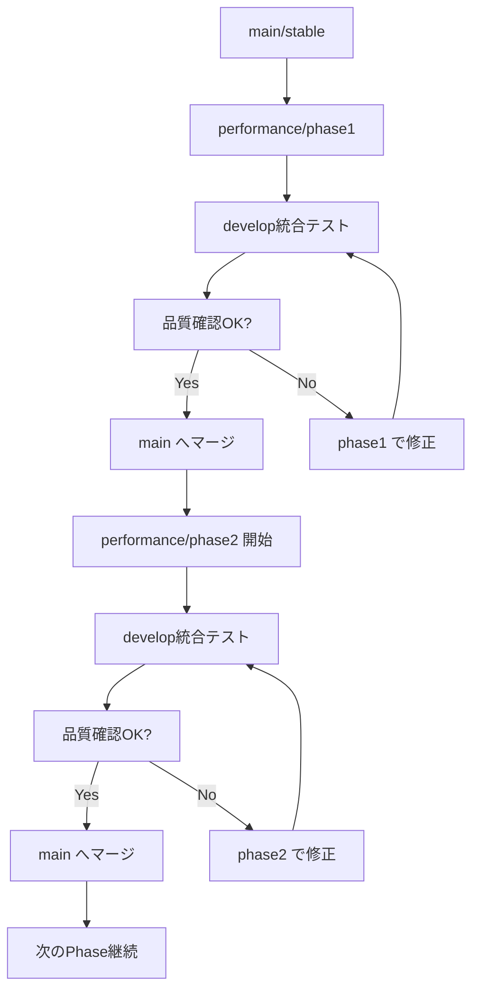

# Git ブランチ運用戦略 - 安定性重視の段階的改善

## 文書概要

このドキュメントは、Civitai Downloader CLIの高性能化開発における Git ブランチ運用戦略を定義します。**安定版を確実に維持**しながら、**段階的に安全な改善**を実現するための包括的なガイドラインです。

## ブランチ構成設計

### 主要ブランチ

```
main (stable)           # 本番環境で使える安定版（Protected）
├── develop            # 新機能統合・テスト用
├── performance/       # 性能改善実験用（段階別）
│   ├── phase1        # Phase1: 測定基盤・安定性強化
│   ├── phase2        # Phase2: タイムアウト対策・フォールバック
│   ├── phase3        # Phase3: 制限的並行処理
│   └── phase4        # Phase4: 高度な最適化
├── feature/           # 個別機能開発用
│   ├── monitoring    # 監視機能開発
│   ├── failsafe      # フェイルセーフ機能
│   └── cli-options   # CLI新オプション
└── hotfix/           # 緊急修正用
    └── security      # セキュリティ修正
```

### 特殊ブランチ

```
benchmark/             # 性能測定専用環境
├── baseline          # 現行版ベンチマーク
├── phase1-test       # Phase1 性能テスト
├── phase2-test       # Phase2 性能テスト
├── phase3-test       # Phase3 性能テスト
├── phase4-test       # Phase4 性能テスト
└── comparison        # バージョン間比較

release/               # リリース準備用
├── v1.1-candidate    # v1.1 リリース候補
├── v1.2-candidate    # v1.2 リリース候補
├── v1.3-candidate    # v1.3 リリース候補
└── v2.0-candidate    # v2.0 リリース候補

experimental/          # 実験的機能
├── async-research    # 非同期実装研究
├── cache-optimization # キャッシュ最適化実験
└── connection-pool   # 接続プール実験
```

## 段階的開発フロー

### Phase別開発プロセス



### 具体的な作業フロー

#### 1. 新Phase開始
```bash
# main から最新を取得
git checkout main
git pull origin main

# 新しいphaseブランチ作成
git checkout -b performance/phase1
git push -u origin performance/phase1

# 対応するベンチマークブランチも作成
git checkout -b benchmark/phase1-test
git push -u origin benchmark/phase1-test
```

#### 2. 開発・テスト
```bash
# 機能開発
git add .
git commit -m "feat(phase1): implement performance monitoring framework"

# 継続的テスト実行
scripts/run_quality_gate.sh

# ベンチマーク測定
scripts/benchmark_compare.sh main performance/phase1
```

#### 3. Phase完了・統合
```bash
# develop へ統合テスト用マージ
git checkout develop
git merge performance/phase1

# 統合テスト実行
pytest tests/integration/ -v
python scripts/stability_test.sh --duration 4h

# 品質ゲート通過後、main へマージ
git checkout main
git merge develop
git tag v1.1.0-phase1
git push origin main --tags
```

## 品質ゲート制御

### Phase別マージ条件

#### Phase 1 完了条件
```yaml
必須チェック項目:
  - 全テストスイート PASS: ✓
  - ベンチマーク測定完了: ✓
  - タイムアウト率 < 1%: ✓
  - 24時間連続実行テスト成功: ✓
  - メモリリーク無し: ✓
  - 文書更新完了: ✓

自動チェック:
  - pytest: 100% PASS
  - ruff: 0 violations
  - mypy: 0 errors
  - black: formatted
  - coverage: ≥ 85%
```

#### Phase 2 完了条件
```yaml
必須チェック項目:
  - Phase1条件 + 安定性向上確認: ✓
  - エラーハンドリング強化テスト: ✓
  - フォールバック機能動作確認: ✓
  - 1週間連続実行テスト成功: ✓
  - 性能劣化 < 5%: ✓

品質指標:
  - タイムアウト率: < 1%
  - エラー自動復旧率: > 95%
  - 全件ダウンロード成功率: > 99%
```

#### Phase 3 完了条件
```yaml
必須チェック項目:
  - Phase2条件 + 性能向上確認: ✓
  - 並行処理安定性テスト: ✓
  - メモリリーク検証: ✓
  - 負荷テスト成功: ✓
  - デッドロック検出: 0件

性能指標:
  - 性能向上: ≥ 120% (Phase1比)
  - 安定性スコア: ≥ Phase2水準
  - 並行処理エラー率: < 0.1%
```

#### Phase 4 完了条件
```yaml
必須チェック項目:
  - Phase3条件 + 最終性能目標達成: ✓
  - 長期間運用テスト: ✓
  - 全環境での動作確認: ✓
  - 本番環境テスト: ✓

最終指標:
  - 性能向上: ≥ 200% (理想目標)
  - 安定性維持または向上: ✓
  - プロダクション対応: ✓
```

### 自動品質チェック実装
```python
# scripts/quality_gate.py
class QualityGate:
    def __init__(self, phase: str):
        self.phase = phase
        self.criteria = self.load_phase_criteria(phase)
        
    def check_performance_regression(self):
        """性能劣化チェック"""
        baseline = self.load_baseline_metrics()
        current = self.run_benchmark()
        
        regression = (baseline.speed - current.speed) / baseline.speed
        
        if regression > self.criteria['max_regression']:
            raise QualityGateError(f"Performance regression: {regression:.2%}")
            
        return True
    
    def check_stability_metrics(self):
        """安定性メトリクス確認"""
        metrics = self.run_stability_test()
        
        checks = {
            'timeout_rate': metrics.timeout_rate < self.criteria['max_timeout_rate'],
            'success_rate': metrics.success_rate > self.criteria['min_success_rate'],
            'error_recovery_rate': metrics.recovery_rate > self.criteria['min_recovery_rate']
        }
        
        failed_checks = [k for k, v in checks.items() if not v]
        if failed_checks:
            raise QualityGateError(f"Stability checks failed: {failed_checks}")
            
        return True
    
    def run_full_quality_gate(self):
        """完全な品質ゲート実行"""
        checks = [
            self.check_test_suite,
            self.check_linting,
            self.check_type_checking,
            self.check_performance_regression,
            self.check_stability_metrics,
            self.check_memory_leaks,
            self.check_documentation
        ]
        
        for check in checks:
            check()
            
        print(f"✅ All quality gates passed for {self.phase}")
```

## CI/CD パイプライン設計

### GitHub Actions 設定

#### メインパイプライン
```yaml
# .github/workflows/ci.yml
name: Continuous Integration

on:
  pull_request:
    branches: [main, develop]
  push:
    branches: [performance/*, feature/*, hotfix/*]

jobs:
  # Stage 0: 高速チェック（1-2分）
  quick-checks:
    runs-on: ubuntu-latest
    timeout-minutes: 5
    
    steps:
    - uses: actions/checkout@v4
    
    - name: Setup Python
      uses: actions/setup-python@v4
      with:
        python-version: '3.10'
        
    - name: Install dependencies
      run: |
        pip install -e .[dev]
        
    - name: Lint check
      run: ruff check .
      
    - name: Type check
      run: mypy .
      
    - name: Format check
      run: black --check .
      
  # Stage 1: 単体テスト（3-5分）
  unit-tests:
    needs: quick-checks
    runs-on: ubuntu-latest
    timeout-minutes: 10
    
    steps:
    - uses: actions/checkout@v4
    
    - name: Run unit tests
      run: |
        pytest tests/unit/ -v --cov=civitai_dl --cov-report=xml
        
    - name: Upload coverage
      uses: codecov/codecov-action@v3
      
  # Stage 2: 統合テスト（5-10分）
  integration-tests:
    needs: unit-tests
    runs-on: ubuntu-latest
    timeout-minutes: 15
    
    steps:
    - uses: actions/checkout@v4
    
    - name: Run integration tests
      run: |
        pytest tests/integration/ -v
        
  # Stage 3: 性能テスト（Phase別で条件分岐）
  performance-tests:
    needs: integration-tests
    if: startsWith(github.ref, 'refs/heads/performance/')
    runs-on: ubuntu-latest
    timeout-minutes: 30
    
    steps:
    - uses: actions/checkout@v4
    
    - name: Extract phase from branch
      id: phase
      run: |
        PHASE=$(echo ${{ github.ref }} | sed 's/refs\/heads\/performance\///')
        echo "phase=$PHASE" >> $GITHUB_OUTPUT
        
    - name: Run performance benchmark
      run: |
        python scripts/benchmark.py --phase=${{ steps.phase.outputs.phase }}
        
    - name: Check performance regression
      run: |
        python scripts/check_regression.py --baseline=main --current=HEAD --threshold=0.05
        
  # Stage 4: 安定性テスト（夜間/週次実行）
  stability-tests:
    if: github.event_name == 'schedule' || contains(github.event.pull_request.title, '[stability-test]')
    runs-on: ubuntu-latest
    timeout-minutes: 480  # 8時間
    
    steps:
    - uses: actions/checkout@v4
    
    - name: Run 4-hour stability test
      run: |
        python scripts/stability_test.py --duration=14400 --report-interval=900
        
    - name: Upload stability report
      uses: actions/upload-artifact@v3
      with:
        name: stability-report
        path: reports/stability-*.json
```

#### 性能ベンチマーク専用パイプライン
```yaml
# .github/workflows/benchmark.yml
name: Performance Benchmark

on:
  workflow_dispatch:
    inputs:
      baseline_branch:
        description: 'Baseline branch'
        required: true
        default: 'main'
      target_branch:
        description: 'Target branch'
        required: true
      duration_minutes:
        description: 'Test duration in minutes'
        required: false
        default: '30'

jobs:
  benchmark:
    runs-on: ubuntu-latest
    
    steps:
    - name: Run comprehensive benchmark
      run: |
        python scripts/comprehensive_benchmark.py \
          --baseline=${{ github.event.inputs.baseline_branch }} \
          --target=${{ github.event.inputs.target_branch }} \
          --duration=${{ github.event.inputs.duration_minutes }}
          
    - name: Generate comparison report
      run: |
        python scripts/generate_benchmark_report.py \
          --output=reports/benchmark-comparison.md
          
    - name: Comment PR with results
      if: github.event_name == 'pull_request'
      uses: actions/github-script@v6
      with:
        script: |
          const fs = require('fs');
          const report = fs.readFileSync('reports/benchmark-comparison.md', 'utf8');
          github.rest.issues.createComment({
            issue_number: context.issue.number,
            owner: context.repo.owner,
            repo: context.repo.repo,
            body: report
          });
```

## リリース戦略

### バージョニング戦略

```
v1.0.x - 現行安定版 (hotfixのみ)
├── v1.0.1 - 緊急バグ修正
├── v1.0.2 - セキュリティ修正
└── v1.0.3 - 軽微な修正

v1.1.x - Phase1完了版 (測定基盤・安定性強化)
├── v1.1.0 - Phase1完了リリース
├── v1.1.1 - バグ修正
└── v1.1.2 - 改善版

v1.2.x - Phase2完了版 (タイムアウト対策強化)
├── v1.2.0 - Phase2完了リリース
└── v1.2.1 - 安定性向上

v1.3.x - Phase3完了版 (制限的並行処理)
├── v1.3.0 - Phase3完了リリース
└── v1.3.1 - 性能調整

v2.0.x - Phase4完了版 (完全版)
├── v2.0.0 - 完全版リリース
├── v2.0.1 - 最適化版
└── v2.0.2 - プロダクション版
```

### リリースプロセス

#### 1. Pre-release（Alpha/Beta）
```bash
# Alpha版作成（内部テスト用）
git checkout -b release/v1.1.0-alpha
git tag v1.1.0-alpha
git push origin v1.1.0-alpha

# Beta版作成（限定テスト用）  
git tag v1.1.0-beta
git push origin v1.1.0-beta
```

#### 2. Release Candidate
```bash
# RC版作成（本番環境テスト用）
git checkout -b release/v1.1.0-candidate
python scripts/prepare_release.py --version=1.1.0
git tag v1.1.0-rc.1
git push origin v1.1.0-rc.1

# 本番環境での限定テスト実行
python scripts/production_test.py --version=v1.1.0-rc.1
```

#### 3. Stable Release
```bash
# 正式リリース
git checkout main
git merge release/v1.1.0-candidate
git tag v1.1.0
git push origin main --tags

# PyPI自動デプロイ（GitHub Actions）
# Docker イメージ自動ビルド
# ドキュメントサイト更新
```

#### 4. Rollback Plan（緊急時対応）
```bash
# scripts/emergency_rollback.sh
#!/bin/bash
set -e

STABLE_VERSION=${1:-"v1.0.3"}

echo "🚨 Emergency rollback to $STABLE_VERSION"

# 安定版にチェックアウト
git checkout $STABLE_VERSION

# 緊急パッチ適用（必要に応じて）
if [ -f "patches/emergency.patch" ]; then
    git apply patches/emergency.patch
fi

# 再インストール
pip install -e .

# 動作確認
python -m civitai_dl --version
python -m civitai_dl --help

echo "✅ Rollback completed successfully"
echo "📋 Please test basic functionality before proceeding"
```

## 安全機能とフェイルセーフ

### 自動フォールバック機能

```python
# civitai_dl/core/failsafe.py
class FailsafeManager:
    def __init__(self):
        self.stable_version = "sync"
        self.current_version = self.detect_current_version()
        self.failure_threshold = 3
        self.failure_count = 0
        self.fallback_enabled = True
        
    def detect_current_version(self) -> str:
        """現在のバージョン検出"""
        try:
            # Git tagから検出
            result = subprocess.run(['git', 'describe', '--tags', '--exact-match'], 
                                  capture_output=True, text=True)
            return result.stdout.strip()
        except:
            return "development"
    
    def record_failure(self, error: Exception):
        """失敗記録とフォールバック判定"""
        self.failure_count += 1
        
        error_details = {
            'timestamp': datetime.utcnow().isoformat(),
            'error_type': type(error).__name__,
            'error_message': str(error),
            'version': self.current_version,
            'failure_count': self.failure_count
        }
        
        self.log_failure(error_details)
        
        if self.should_trigger_fallback():
            self.trigger_automatic_fallback()
            
    def should_trigger_fallback(self) -> bool:
        """フォールバック判定"""
        return (
            self.fallback_enabled and 
            self.failure_count >= self.failure_threshold
        )
    
    def trigger_automatic_fallback(self):
        """自動フォールバック実行"""
        logger.critical(f"Triggering automatic fallback after {self.failure_count} failures")
        
        try:
            self.switch_to_stable_mode()
            self.notify_administrators()
            self.reset_failure_count()
        except Exception as e:
            logger.critical(f"Fallback failed: {e}")
            self.emergency_shutdown()
    
    def switch_to_stable_mode(self):
        """安定モードに切り替え"""
        # 実験的機能を無効化
        config = DownloadConfig.load()
        config.experimental_flags = {}
        config.enable_parallel = False
        config.save()
        
        # 安定版コンポーネントに切り替え
        from civitai_dl.core.stable import StableDownloadService
        return StableDownloadService(config)
    
    def log_failure(self, error_details: dict):
        """失敗ログ記録"""
        log_file = Path("logs/failures.jsonl")
        log_file.parent.mkdir(exist_ok=True)
        
        with open(log_file, "a") as f:
            f.write(json.dumps(error_details) + "\n")
```

### 監視とアラート

```python
# civitai_dl/monitoring/alerts.py
class AlertManager:
    def __init__(self):
        self.thresholds = {
            'error_rate': 0.05,      # 5%
            'timeout_rate': 0.01,    # 1%
            'memory_usage_mb': 2048, # 2GB
            'disk_usage_percent': 90 # 90%
        }
        
    def check_system_health(self) -> List[Alert]:
        """システム健全性チェック"""
        alerts = []
        metrics = self.collect_current_metrics()
        
        # エラー率チェック
        if metrics['error_rate'] > self.thresholds['error_rate']:
            alerts.append(Alert(
                level=AlertLevel.WARNING,
                message=f"High error rate: {metrics['error_rate']:.2%}",
                metric='error_rate',
                value=metrics['error_rate'],
                threshold=self.thresholds['error_rate']
            ))
            
        # タイムアウト率チェック
        if metrics['timeout_rate'] > self.thresholds['timeout_rate']:
            alerts.append(Alert(
                level=AlertLevel.CRITICAL,
                message=f"High timeout rate: {metrics['timeout_rate']:.2%}",
                metric='timeout_rate',
                value=metrics['timeout_rate'],
                threshold=self.thresholds['timeout_rate']
            ))
            
        return alerts
    
    def send_alerts(self, alerts: List[Alert]):
        """アラート送信"""
        for alert in alerts:
            if alert.level == AlertLevel.CRITICAL:
                self.send_immediate_notification(alert)
            else:
                self.queue_for_batch_notification(alert)
```

## 開発者向けコマンド

### ブランチ管理コマンド

```bash
# scripts/branch_management.sh

# 新しいphase開始
create_phase() {
    local phase=$1
    echo "🚀 Creating Phase $phase branch..."
    
    git checkout main
    git pull origin main
    git checkout -b performance/phase$phase
    git push -u origin performance/phase$phase
    
    # ベンチマーク用ブランチも作成
    git checkout -b benchmark/phase$phase-test
    git push -u origin benchmark/phase$phase-test
    
    echo "✅ Phase $phase branches created"
}

# 品質チェック実行
run_quality_checks() {
    echo "🔍 Running quality checks..."
    
    # 静的解析
    ruff check . --fix
    mypy .
    black .
    
    # テスト実行
    pytest tests/unit/ -v
    pytest tests/integration/ -v
    
    # カバレッジチェック
    pytest --cov=civitai_dl --cov-report=html --cov-fail-under=85
    
    echo "✅ Quality checks completed"
}

# ベンチマーク比較
benchmark_compare() {
    local baseline=${1:-main}
    local target=${2:-HEAD}
    
    echo "📊 Running benchmark comparison: $baseline vs $target"
    
    python scripts/benchmark_compare.py \
        --baseline=$baseline \
        --target=$target \
        --output=reports/benchmark-$(date +%Y%m%d-%H%M%S).json
    
    echo "✅ Benchmark comparison completed"
}

# 安定性テスト実行
stability_test() {
    local duration=${1:-14400}  # デフォルト4時間
    
    echo "⏱️  Running stability test for $duration seconds..."
    
    python scripts/stability_test.py \
        --duration=$duration \
        --report-interval=900 \
        --output=reports/stability-$(date +%Y%m%d-%H%M%S).json
    
    echo "✅ Stability test completed"
}
```

### 開発環境セットアップ

```bash
# scripts/dev_setup.sh
#!/bin/bash

echo "🔧 Setting up development environment..."

# Python仮想環境作成
python -m venv venv
source venv/bin/activate  # Windows: venv\Scripts\activate

# 依存関係インストール
pip install -e .[dev]

# Git hooks設定
cp scripts/pre-commit .git/hooks/
chmod +x .git/hooks/pre-commit

# 設定ファイル作成
cp config/dev.config.template config/dev.config

echo "✅ Development environment setup completed"
echo "💡 Next steps:"
echo "   1. Activate virtual environment: source venv/bin/activate"
echo "   2. Edit config/dev.config with your API key"
echo "   3. Run tests: pytest"
echo "   4. Start development: git checkout -b feature/your-feature"
```

### 継続的監視コマンド

```bash
# scripts/monitor.sh
#!/bin/bash

monitor_performance() {
    echo "📈 Starting performance monitoring..."
    
    while true; do
        # メトリクス収集
        python scripts/collect_metrics.py --output=logs/metrics-$(date +%Y%m%d-%H%M).json
        
        # アラートチェック
        python scripts/check_alerts.py --config=config/alerts.yml
        
        # 30秒待機
        sleep 30
    done
}

monitor_stability() {
    echo "🔍 Starting stability monitoring..."
    
    # ログファイル監視
    tail -f logs/download.log | while read line; do
        if echo "$line" | grep -q "ERROR\|TIMEOUT\|FAILURE"; then
            echo "⚠️  Issue detected: $line"
            python scripts/handle_issue.py --log-line="$line"
        fi
    done
}
```

## トラブルシューティング

### 問題発生時の対応フロー

#### 1. 即座対応（1-5分以内）
```bash
# 実験機能無効化
export CIVITAI_DL_DISABLE_EXPERIMENTAL=1

# 安定モードで実行
civitai-dl --force-sync-mode --max-retries=5

# システム状態確認
python scripts/health_check.py
```

#### 2. 根本分析（15-30分以内）
```bash
# 詳細ログ収集
python scripts/collect_debug_info.py --output=debug-$(date +%Y%m%d-%H%M%S).zip

# メトリクス分析
python scripts/analyze_metrics.py --timerange=1h

# エラーパターン分析
python scripts/analyze_errors.py --log-file=logs/download.log
```

#### 3. 修正実装・再テスト
```bash
# ホットフィックス作成
git checkout -b hotfix/issue-$(date +%Y%m%d)

# 修正実装
# ... コード修正 ...

# 緊急テスト実行
python scripts/emergency_test.py

# デプロイ
git checkout main
git merge hotfix/issue-$(date +%Y%m%d)
```

#### 4. 段階復旧
```bash
# カナリアリリース
python scripts/canary_deploy.py --percentage=10

# 段階的ロールアウト
python scripts/gradual_rollout.py --percentage=50

# 全面適用
python scripts/full_deployment.py
```

### よくある問題と解決策

#### 問題1: 性能劣化検出
```bash
# 症状: ベンチマークで性能劣化
# 原因: 新機能による予期しないオーバーヘッド
# 解決: プロファイリングによるボトルネック特定

python -m cProfile -o profile.prof -m civitai_dl --users test_users.txt
python scripts/analyze_profile.py profile.prof
```

#### 問題2: メモリリーク
```bash
# 症状: 長時間実行でメモリ使用量増加
# 原因: オブジェクトの循環参照、リソース未開放
# 解決: メモリプロファイリング

pip install memory-profiler
python -m memory_profiler scripts/memory_test.py
```

#### 問題3: タイムアウト頻発
```bash
# 症状: 特定のAPIコールでタイムアウト
# 原因: サーバー負荷、ネットワーク不安定
# 解決: 動的タイムアウト調整

python scripts/tune_timeouts.py --adaptive --log-file=logs/timeouts.log
```

---

この Git ブランチ運用戦略により、安定版を確実に維持しながら、段階的に安全な改善を実現します。